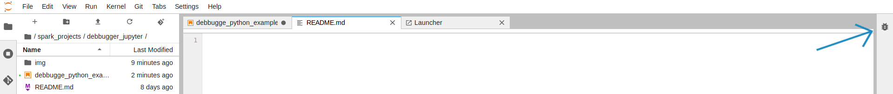
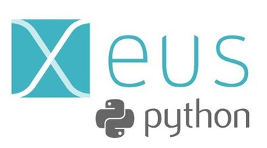
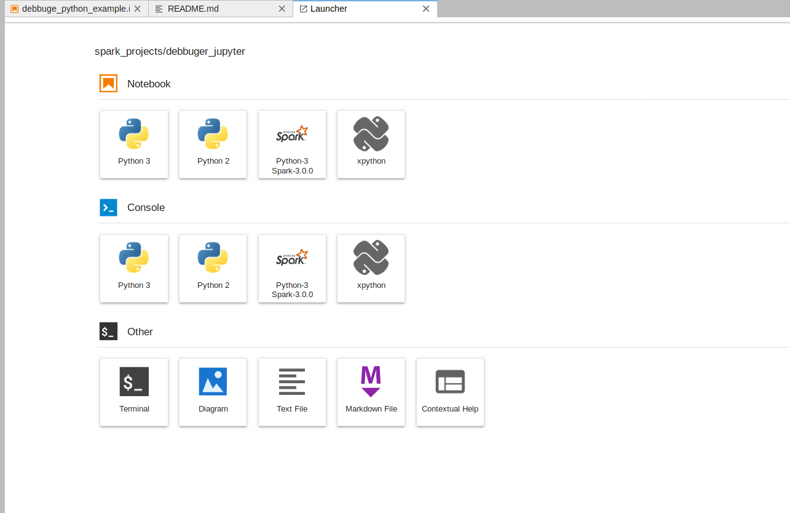

<div style="text-align: center; line-height: 0; padding-top: 9px;">
  
</div>

## Debbugger for JupyterLab - Notebook Example

#### Today, I will show you the further steps to install the first public release of the Jupyter visual debugger!, and handling 3 examples

#### This is just the first release, but we can already set breakpoints in notebook cells and source files, inspect variables, navigate the call stack and more.

### Steps shown in this Notebook:
* #### Dubbugger extension Installation 
* #### Xeus-python Installation, the first Jupyter Kernel to support debugging
* #### 1st Example : Debbugging function
* #### 2nd Example : Dubbugging dataframe (Pandas)
* #### 3rd example : Handling The new Xeus-python kernel (+ Bonus)

## Dubbugger extension Installation
#### To install Debbugging extension in jupyterlab the following command.

```sh
 $ jupyter labextension install @jupyterlab/debugger 

```

### You will see a small icon 🐞 in jupyterlab environnement (in top-right)

<div style="text-align: center; line-height: 0; padding-top: 9px;">
  
</div>

## Xeus-python Installation, the first Jupyter Kernel to support debugging


<div style="text-align: left; line-height: 0; padding-top: 9px;padding-left: 9px;">
  
</div>

## What is Xeus :

#### Xeus is a C++ implementation of the Jupyter kernel protocol. It is not a kernel by itself but a library that helps kernel authoring. 

#### Xeus is very helpful when developing a kernel for a language that has a C or a C++API (Python, Lua, SQL, etc.). 
#### It takes the cumbersome task of implementing the Jupyter messaging protocol for you so you just can focus on the core interpreter tasks: executing code, inspecting, completing, etc.

## Xeus-python installation 

### Installing from conda and Pypi
## conda 

```sh
$ conda install xeus-python notebook -c conda-forge
```
## Pypi

```sh
$ pip install xeus-python notebook
```

```Note: the wheels uploaded on PyPI are experimental. ```

#### After installing Xeus-python lib we shoud have Xpyton kernel added into JupyterLab

<div style="text-align: center; line-height: 0; padding-top: 9px;">
  
</div>

## 1st Example : Debbugging function
``` python 
## Function example  
result = 0; # This is global variable.
# Function definition is here
def multi( arg1, arg2 ):
   # multiply both the parameters and return them."
   result = arg1 * arg2; # Here total is local variable.
   print ("Inside the function local result : ", result)
   return result;

# Now you can call multiplication function
multi( 10, 20 );
print ("Outside the function global result : ", result )
```

## 2nd Example : Debbugging dataframe (Pandas)

```python
# dataframe example 
# DataFrame using arrays. 
import pandas as pd 
  
# initialise data of lists. 
data = {'Name':['Imrane', 'Philippe', 'Mohammed', 'Abdelbarre'], 'marks':[99, 98, 95, 90]} 
  
# Creates pandas DataFrame. 
df = pd.DataFrame(data, index =['rank1', 'rank2', 'rank3', 'rank4']) 
  
# print the data 
df 

```

## 3rd example : Handling The new Xeus-python kernel (Bonus 🔭 )


#### Code completion:

```python
## Example of completion 
import pandas as pnd
import numpy as np
### Function 
multi(3,25)

```

## Bonus: Real-time communication for the web
#### The ipywebrtc is WebRTC and MediaStream API exposed in the Jupyter notebook/lab
### What is WebRTC
#### With WebRTC, you can add real-time communication capabilities to your application that works on top of an open standard. It supports video, voice, and generic data to be sent between peers, allowing developers to build powerful voice- and video-communication solutions.

### Installing Using Pypi

```sh
$ pip install ipywebrtc
```


#### Play Stream Video

```python 
from ipywebrtc import VideoStream
# commented out since it increases the size of the notebook a lot, you can connect this part with you azure/aws /google storage account
video = VideoStream.from_file('./data/mars_nasa.mp4')
video

```

### CameraStream
#### in this example we will call  cameraStream using ipywebrtc
```python
from ipywebrtc import CameraStream, ImageRecorder
camera = CameraStream(constraints=
                      {'facing_mode': 'user',
                       'audio': False,
                       'video': { 'width': 700, 'height': 350 } ## You can change the width and height
                       })
camera
```

<div style="text-align: center; line-height: 0; padding-top: 9px;">
  
</div>

### Useful references to read : 

#### 1 - more about visual debbugger : https://blog.jupyter.org/a-visual-debugger-for-jupyter-914e61716559
#### 2 - more about Xeus : https://blog.jupyter.org/a-new-python-kernel-for-jupyter-fcdf211e30a8 
#### 3 - more about ipywebrtc https://ipywebrtc.readthedocs.io/en/latest/VideoStream.html
#### 4 - more about webRTC https://webrtc.org/getting-started/media-capture-and-constraints
